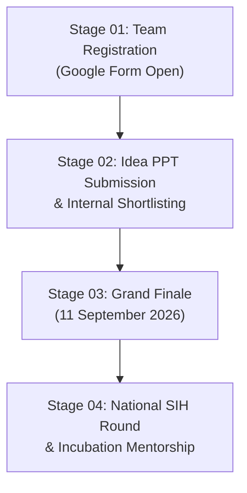

# India Smart Hackathon (SIH) — Web Portal

[](https://forms.gle/QCQWTcSJoKSEKExD9)
[](https://fonts.google.com/)
[-34A853?style=for-the-badge&logo=webrtc&logoColor=white)](#-multilingual-sih-assistant-chatbot)
[](https://forms.gle/QCQWTcSJoKSEKExD9)

Official responsive web application for the **India Smart Hackathon (SIH)** organized at **D Y Patil School of Engineering and Management (DYPSEM)**, D. Y. Patil Education Society, Kolhapur.

> **Motto**: THINK. BUILD. SOLVE.  
> **Tagline**: *"Ideas + Innovation = Impact • One Challenge. Endless Possibilities."*  
> **Grand Finale Date**: **11 September 2026**  
> **Registration Form**: [https://dypsih.unaux.com](https://dypsih.unaux.com)
---

## 📌 Table of Contents

- [Overview](#-overview)
- [Key Features](#-key-features)
- [Multilingual SIH Assistant Chatbot](#-multilingual-sih-assistant-chatbot)
- [Project Directory Structure](#-project-directory-structure)
- [Innovation Tracks](#-innovation-tracks)
- [Event Timeline](#-event-timeline)
- [Tech Stack](#-tech-stack)
- [How to Run Locally](#-how-to-run-locally)
- [Browser Compatibility](#-browser-compatibility)
- [Credits & Institution](#-credits--institution)

---

## 🚀 Overview

The portal serves as the single source of truth for the campus internal edition of the **India Smart Hackathon (SIH)**. Built strictly adhering to the **Google Light Theme** design system (Material Design 3), the site delivers an aesthetic, accessible, and responsive user experience across mobile phones, tablets, and desktop workstations.

---

## 🌟 Key Features

### 1. Embedded Header Promo Video
- **Source**: `assets/MEDIA/dyptemsih.mp4`
- **Configuration**: `autoplay muted loop playsinline preload="auto"`
- **Distraction-Free**: Video player controls and overlay tags are hidden on both desktop and mobile devices for a clean cinematic teaser.
- **Mobile-First Layout**: Automatically renders at the very top of the screen (`order: -1`) on mobile viewports for immediate engagement.

### 2. Showcase Video ("Hackathon in Action")
- **Source**: `assets/MEDIA/footer.mp4`
- **Location**: Mounted directly above the **"One Challenge. Endless Possibilities."** section.
- **IntersectionObserver**: Starts playback automatically when scrolled into view.
- **Interactive Controls**:
  - **Tap / Click to Play/Pause**: Quick pause or resume by clicking anywhere on the video.
  - **Floating Audio Pill**: Discreet corner toggle button switching between **Muted** and **Audio On**.

### 3. Google Light Theme Design System
- Signature **Google 4-color stripe** (Blue `#1A73E8`, Red `#EA4335`, Yellow `#FBBC05`, Green `#34A853`).
- Clean white backgrounds (`#FFFFFF`) with subtle surface tints (`#F8F9FA`) and Material 3 elevation shadows.
- Typography powered by **Google Sans** and **Roboto**.
- Rounded-pill buttons and interactive cards with hover micro-interactions.

### 4. Official Event Poster & Lightbox
- High-resolution preview of the official hackathon poster (`assets/MEDIA/poster.jpg`).
- Click-to-zoom interactive modal lightbox with keyboard `ESC` dismissal.

### 5. Event Foundations (Pillars from Poster)
- 🟡 **THINK (Innovate)**: Bring creative ideas to life with design thinking and rapid ideation.
- 🔵 **BUILD (Collaborate)**: Form 6-member cross-disciplinary squads and develop prototypes.
- 🟢 **SOLVE (Compete)**: Pitch to industry juries and earn national SIH nominations.

### 6. Four Core Values
- 🎯 **Real Problems**: Authentic challenges sourced from civic bodies and industry partners.
- 🚀 **Big Ideas**: Disruptive AI, Web3, IoT, and embedded system architectures.
- 🤝 **Great Impact**: Deployments solving real societal needs.
- 🏆 **Exciting Prizes**: Cash awards, certificates of excellence, and incubation mentorship.

---

## 🤖 Multilingual SIH Assistant Chatbot

An AI-powered client-side assistant accessible via a floating action button (FAB) at the bottom right.

- **3 Supported Languages**:
  - 🇬🇧 **English (EN)**
  - 🇮🇳 **मराठी (MR)**
  - 🇮🇳 **हिंदी (HI)**
- **Text-To-Speech (TTS)**:
  - Powered by the native browser **Web Speech API** (`SpeechSynthesisUtterance`).
  - Automatically speaks bot responses in localized accents (`en-IN`, `mr-IN`, `hi-IN`).
  - Global audio mute/unmute header toggle + individual **"Listen"** replay buttons on each message bubble.
- **Typewriter Effect**: Streams character-by-character typing animation with a blinking cursor.
- **Default Question Suggestions**: One-click quick suggestion chips dynamically localized to the active language (Date, Registration link, Team rules, Tracks, Prizes, Venue).
- **Zero-Latency Offline Knowledge**: Responds instantly without requiring external API keys.

---

## 📂 Project Directory Structure

```text
DYPTEM_SIH/
│
├── index.html                      # Main HTML landing page
├── README.md                       # Project documentation
│
└── assets/
    ├── CSS/
    │   └── style.css              # Google Light Theme styles & media queries
    │
    ├── JS/
    │   └── main.js                # Video logic, Chatbot engine, TTS, drawer, modal
    │
    └── MEDIA/
        ├── dyptemsih.mp4          # Header teaser promo video
        ├── footer.mp4             # Showcase video above challenges
        └── poster.jpg             # High-resolution official event poster
```

---

## 🎯 Innovation Tracks

| Track # | Track Name | Focus Domains |
|:---:|:---|:---|
| **01** | **AI & Smart Automation** | Autonomous workflows, LLM agents, Computer Vision, Analytics |
| **02** | **Smart Agriculture & IoT** | Precision farming, soil telemetry, automatic irrigation networks |
| **03** | **Clean Energy & Green Tech** | Renewable microgrids, EV charging, carbon audit tech |
| **04** | **Healthcare & MedTech** | Telemedicine, patient vitals monitoring, diagnostic aids |
| **05** | **FinTech & Cyber Security** | Fraud detection, secure micro-transactions, zero-trust auth |
| **06** | **Open Innovation** | Disruptive student-driven hardware and software solutions |

---

## 🗓️ Event Timeline



---

## 💻 Tech Stack

- **Markup**: Semantic HTML5 with accessibility attributes (`aria-labels`, `role`).
- **Styling**: Vanilla CSS3 (Custom properties, Flexbox, CSS Grid, Material 3 Elevation).
- **Interactivity**: Pure Vanilla JavaScript (ES6+), Web Speech API, Intersection Observer API.
- **Fonts**: Google Sans, Roboto, Outfit (via Google Fonts).
- **Icons**: Handcrafted lightweight SVGs.
- **Dependencies**: 0 external npm/JS frameworks required — completely zero-build and lightweight.

---

## 🏃 How to Run Locally

### Option 1: Python Built-in Server (Recommended)
Open your terminal inside the project root (`DYPTEM_SIH`):
```powershell
python -m http.server 8080
```
Then navigate to `http://localhost:8080` in any web browser.

### Option 2: VS Code Live Server
1. Open the project folder in Visual Studio Code.
2. Right-click on `index.html`.
3. Select **"Open with Live Server"**.

### Option 3: Direct File Opening
You can directly double-click `index.html` to open it in your default web browser.

---

## 🌐 Browser Compatibility

| Browser | Version Supported |
|:---|:---:|
| **Google Chrome** | 80+ |
| **Mozilla Firefox** | 78+ |
| **Microsoft Edge** | 80+ |
| **Apple Safari** | 13.1+ |
| **Mobile Browsers (iOS / Android)** | All modern versions |

> **Note**: Autoplay policies require videos to be `muted` to automatically play without user interaction, which is pre-configured on all video tags.

---

## 🏛️ Credits & Institution

- **Institution**: **D Y Patil School of Engineering and Management (DYPSEM)**
- **Organization**: D. Y. Patil Education Society, Kolhapur, Maharashtra, India.
- **Event**: India Smart Hackathon (SIH) — Internal Hackathon Edition.
- **Official Logo**: [D Y Patil Education Society](https://encrypted-tbn0.gstatic.com/images?q=tbn:ANd9GcQNmjDdeoSpeWkuiAPLezY8nu-t4BVta89x7gGvU2ltow&s=10)
- **Registration**: [Official Google Form Link](https://forms.gle/QCQWTcSJoKSEKExD9)

---

*© 2026 D Y Patil School of Engineering and Management. All Rights Reserved. Be The Change. Build The Future.*
